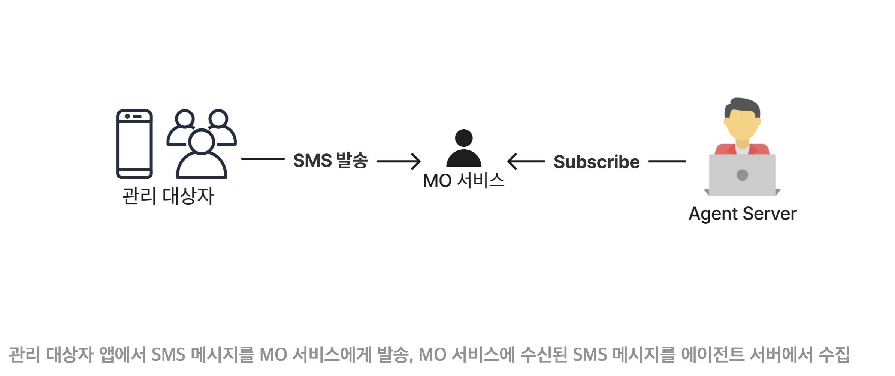
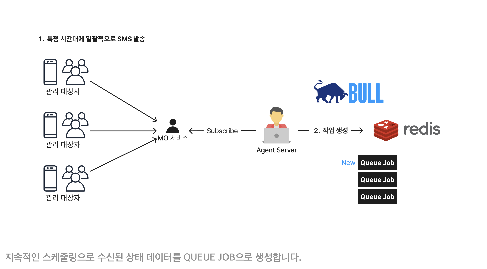
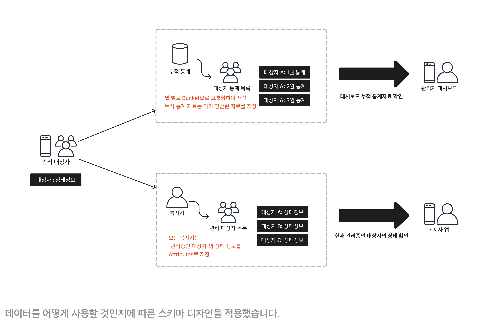
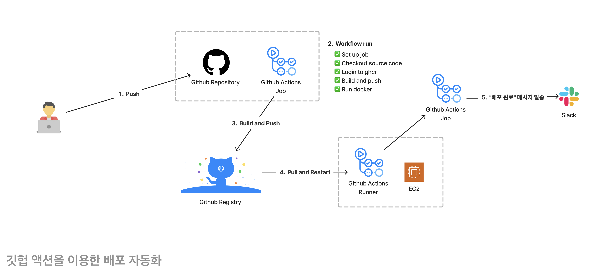
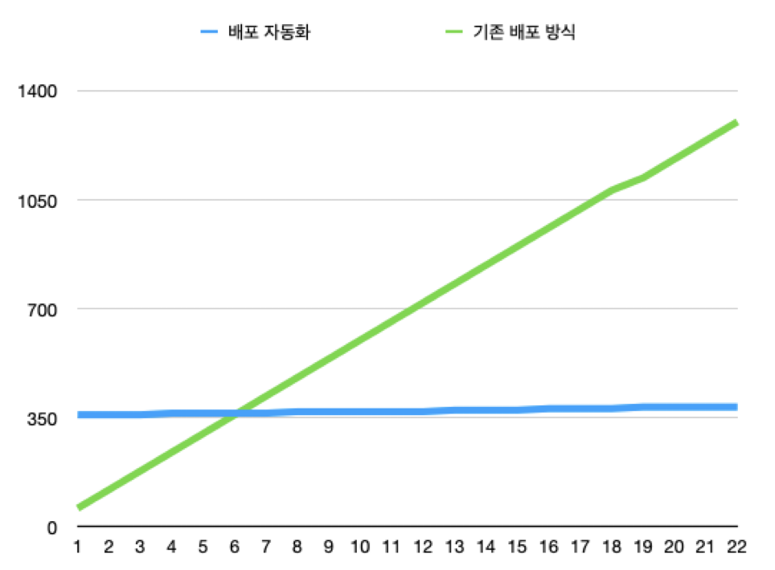
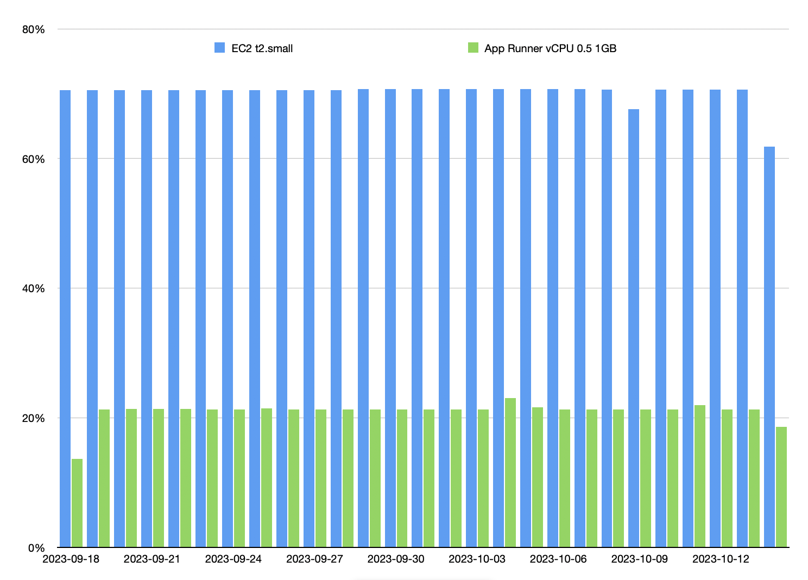
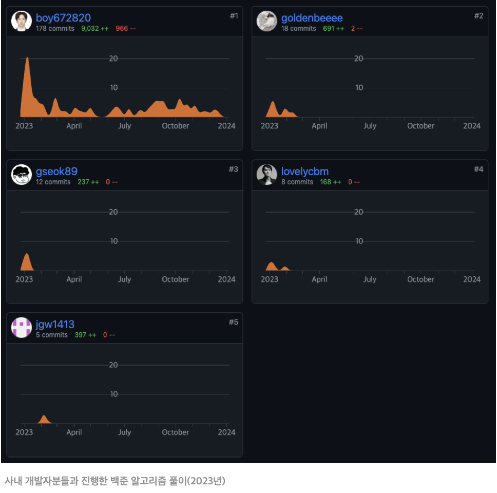

<!-- _class: lead -->

# 경력기술서

##### 성과

1. **오프라인 모니터링 서비스**
2. **컨테이너 기반 배포 자동화 구축**
3. **운영 비용 40% 절감했던 사례**
4. 

###### 이선주  [boy672820@gmail.com][boy672820]

[boy672820]: https://github.com/boy672820

---

# 1. 오프라인 모니터링 서비스

오프라인 환경에서의 사용자 모니터링 서비스를 운영했던 경험에 대해서 소개합니다.

---

## 요구사항 분석

누적 관리 대상자 400명, 지속적인 모니터링을 진행하며 하루 1200건 이상의 상태 정보를 수집 및 가공 합니다. 가공된 정보는 복지사에게 제공합니다.

| 요구사항                     | 문제점                                                       |
| ---------------------------- | ------------------------------------------------------------ |
| 관리 대상자 상태 데이터 수집 | 오프라인 상태를 고려해야 합니다.                             |
| 상태 데이터 일괄적 수신      | 정해진 시간대에 모든 관리 대상자의 정보를 수집해야 합니다.   |
| 상태 정보 관리               | 오전 또는 오후 기상자 체크와 긴급 알림 등을 제어해야 합니다. |

## [1.1] 오프라인 환경에서 MO 서비스를 이용한 모니터링

관리 대상자 특성상 인터넷이 되지 않은 환경이었습니다.

때문에 암호화된 상태 데이터를 SMS 메시지로 발송합니다. 이후 수집된 SMS 메시지는 에이전트 서버에서 가공하여 MongoDB에 저장합니다.

---

## [1.2] 작업 대기열을 통한 부하 분산

정해진 시간대에 모든 상태 데이터를 발송하기 때문에 트래픽이 몰리는 경향이 있었습니다.

때문에 Message Queue를 이용하여 다음과 같은 문제점을 해결하였습니다.

 - 작업 대기열을 통해 부하 분산: **과부하로 인한 서버 다운을 방지**
 - 작업을 Redis에서 관리: **서버가 다운되더라도 작업 재처리 가능**

---

## [1.3] 다양한 상태 정보 관리

관리 대상자의 다양한 데이터 관리, 자주 변경되는 요구사항, 누적 데이터에 따른 확장성을 고려하여 MongoDB를 도입하였습니다.

상태 정보는 MongoDB에서 관리되며, 이를 통해 다음과 같은 이점이 있었습니다.

 - 대상자 현재 상태와 복지사 모니터링: Attributes 패턴으로 대상자의 상태 데이터를 비교적 쉽게 여러 컬렉션에 분산하여 관리
 - 누적 통계 이용: Bucket 패턴과 Computed 패턴으로 효율적인 쿼리 가능

---

# 2. 컨테이너 기반 배포 자동화 구축

배포 자동화를 통해 업무 효율성을 향상시킨 사례에 대해 설명합니다.

---

## [2.1] 배포 자동화 구축

기존 FTP를 이용한 배포 프로세스는 다음과 같은 문제가 있었습니다.

 - 로컬 환경과 프로덕트 환경 불일치로 잦은 에러 발생: 애플리케이션 실행 환경의 일관성을 유지
 - 서버 배포가 번거롭고 시간적 비용 발생: 비교적 쉬운 배포 달성

 

더 나아가 배포 자동화를 통해 개발에 집중할 수 있게 되었습니다.

Github Actions를 통해 메인 브랜치가 업데이트 되면 자동으로 빌드 후 배포할 수 있도록 Github Actions를 설정하였습니다.
또한 배포가 완료되면 변경사항을 팀원들이 확인할 수 있도록 Slack Incoming WebHooks를 구성하였습니다.

---

## [2.2] 배포 자동화를 통한 달성

배포 자동화를 통해 얼마나 시간이 절약되고 팀 내에서의 긍정적인 효과는 어떠했는지 수치로 표현해 보았습니다.

하루 배포 횟수 5회를 기준으로 봤을 때, 배포 자동화를 통해 하루 평균 1시간을 절약할 수 있었습니다.

 - 프로젝트 초기
   - 기존 배포 방식: 소요시간 거의 없음
   - 배포 자동화: 6시간 소요
 - 프로젝트 후반
   - 기존 배포 방식: 총 21시간 소요
   - 배포 자동화: 6시간 소요

---

# 3. 운영 비용 40% 절감 사례

AWS Infra 환경을 개선하여 운영 비용을 절감할 수 있었던 사례에 대해 소개합니다.

---

## [3.1] AWS EC2에서 App Runner 도입

AWS AppRunner를 도입한 이유는 다음과 같습니다.

 - 기존 EC2에서 운영중인 컨테이너 기반 앱과 호환이 좋음
 - 초기 개발 단계와 트래픽이 거의 없는 서비스에서 운영 비용 절감
 - 웹 서버 설치와 설정 등 필요 없이 API 서비스 자동 구축
 - Github Actions와 연동이 잘되어 있어 ECR을 통한 쉬운 배포 자동화 가능

## [3.2] EC2 vs AppRunner 비교
App Runner는 Serverless 특성상 애플리케이션 요청이 처리되면 서버가 활성화 되었다고 판단되어 요금이 산정됩니다.

한 달 기준으로 다음과 같은 요금이 부과됩니다.

 - t2.micro 온디멘드 요금제 예상 비용: 10 USD
 - App Runner(vCPU 0.5 Core / Memory 1GB) 예상 비용: 8.50 USD

실제로 Cost Explorer에서 비교해본 결과, EC2에 비해서 AppRunner가 40% 비용 절감을 이루어낼 수 있었습니다.

---

# 4. 사내 스터디 운영

사내 개발자들의 개발 역량과 영감을 주기위해 2022년부터 꾸준히 스터디를 진행해 왔습니다.

## [4.1] 스터디 운영

스터디는 발표자와 참여자로 나누어 각자 원하는 주제를 발표하고 피드백하는 방식으로 운영 중 입니다.

스터디 자료는 사내 개발자분들이 언제든지 참고할 수 있도록 블로그와 깃허브에 개시하였습니다.

